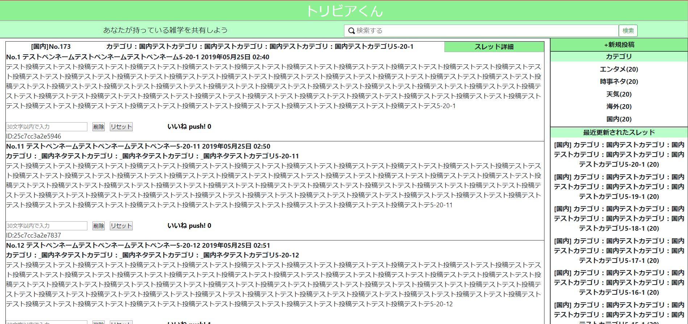
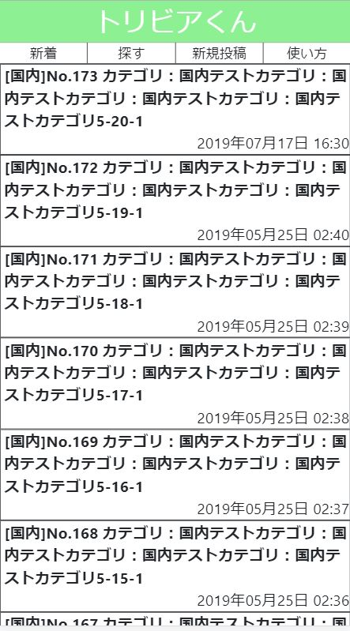
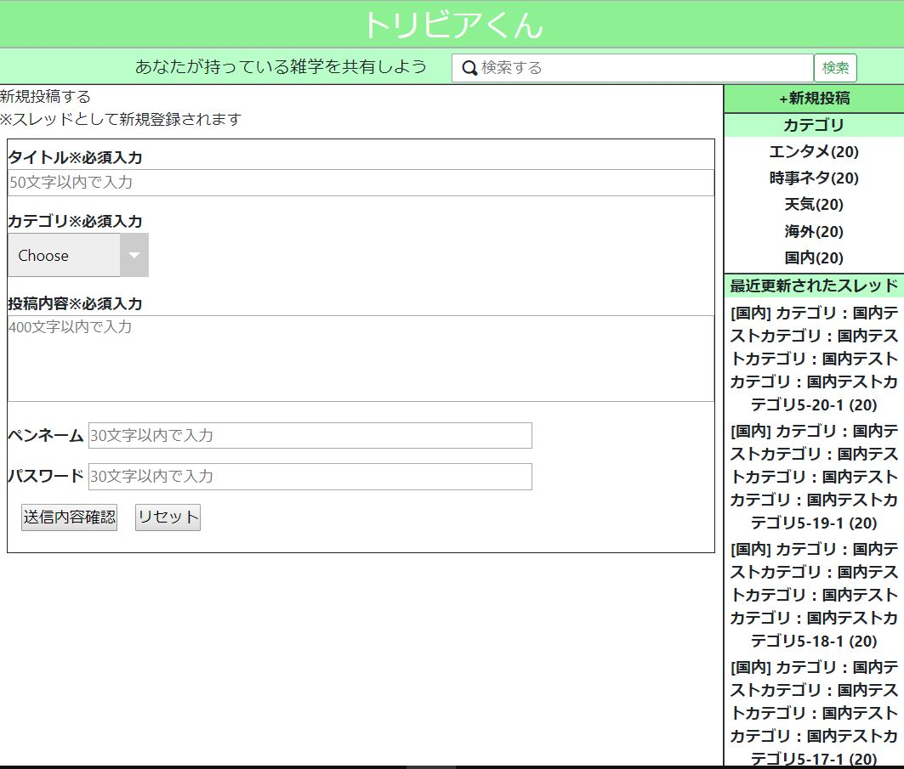
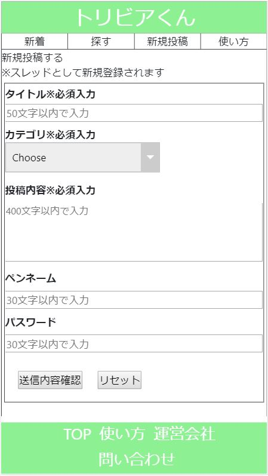
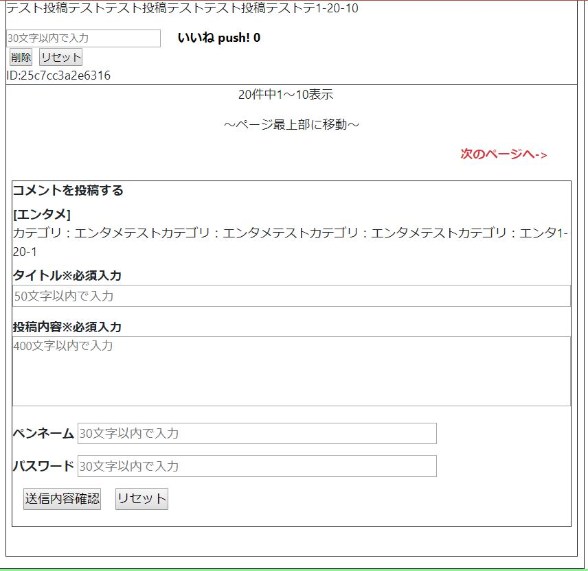
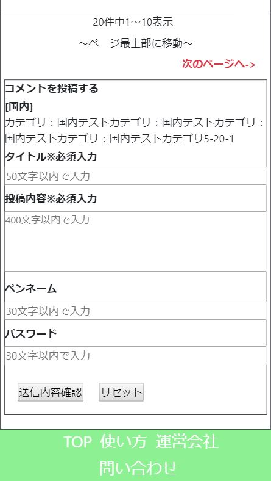

# PHP掲示板

## プログラム説明
  ・スレッド形式の掲示板で、カテゴリ追加対応しています。  
  ・DBサーバーが使用できない環境など想定して、JSONファイルで投稿データの運用にも対応。  
  ・レスポンシブ対応  

## 開発の目的
  ・Apache、PHP、SQLを使用した開発スキルの向上

## 開発、テスト環境
  Apache  2.2.34（AWS)  
  PHP     7.1.30  
  MySQL   5.7.25  

## 動作手順
  1.クローンを取得してApacheのドキュメントルートに配置  (下記画面はXAMPPのデフォルトに配置した場合)
  
　

  2.db_dmp/tribia_dev.sqlをMySQLのDBにリストアして、テーブルを作成  
  3.trivia_BBS/bbs/DB_config.phpに手順2でリストアしたDBサーバーのホスト名またはIPアドレス、  
    ユーザー名、パスワード、DB名を入力
  4.`http://localhost/TriviaBBS/bbs/io_select.php`にアクセスで、DBまたはJSON選択、  
  クリックで各Topページに遷移します。

    

### Top画面(PC)  
    
### Top画面(SP)  
    
### 投稿画面(PC)  
    
### 投稿画面(SP)  
    
### コメント投稿画面(PC)  
    
### コメント投稿画面(SP)  
    