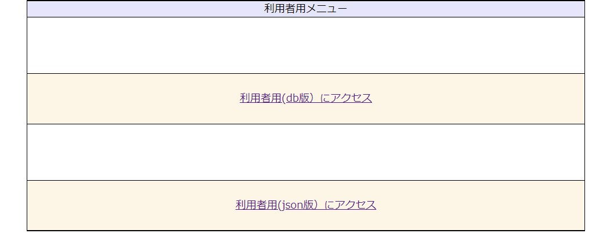

# PHP掲示板

## プログラム説明
  ・スレッド形式の掲示板で、カテゴリ追加対応しています。
  ・DBサーバーが使用できない環境など想定して、JSONファイルで投稿データの運用にも対応。
  ・レスポンシブ対応
  ・

## 開発の目的
  ・Apache、PHP、SQLを使用した開発スキルの向上

## 開発、テスト環境
  Apache  2.2.34（AWS)
  PHP     7.1.30
  MySQL   5.7.25

## 動作手順
  1.クローンを取得してApacheのドキュメントルートに配置
  2.db_dmp/tribia_dev.sqlをMySQLのDBにリストアして、テーブルを作成
  3.trivia_BBS/bbs/DB_config.phpに手順2でリストアしたDBサーバーのホスト名またはIPアドレス、
    ユーザー名、パスワード、DB名を入力

  4.http://Webサーバー名/bbs/io_select.phpにアクセスで、DBまたはJSON選択、
  　クリックで各Topページに遷移します。

  